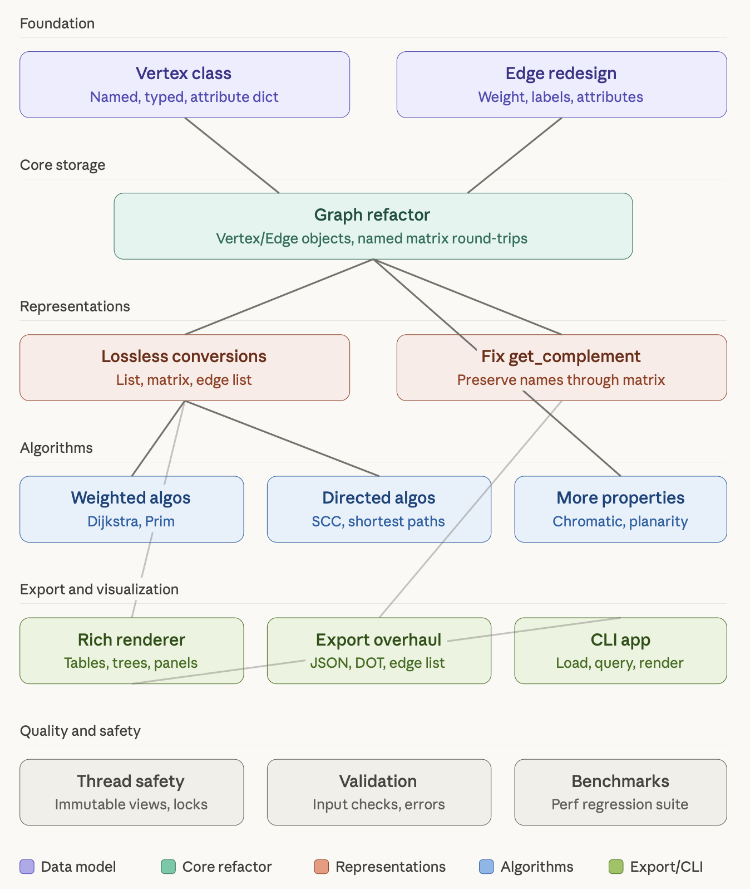

# Graphworks

[](https://github.com/nathan-gilbert/graphworks/actions/workflows/python-package-ci.yml)

## A Python module for efficient graph theoretic programming

[Documentation](https://graphworks.readthedocs.io) |
[Wiki](https://github.com/nathan-gilbert/graphworks/wiki)

### Quick Start

```sh
pip install graphworks
```

```python
import json
from graphworks.graph import Graph

json_graph = {"label": "my graph", "edges": {"A": ["B"], "B": []}}
graph = Graph("my graph", input_graph=json.dumps(json_graph))
print(graph)
```

Optional extras:

```sh
pip install graphworks[matrix]   # numpy adjacency matrix support
pip install graphworks[viz]      # graphviz export
```

## Development

### Requirements

- Python 3.13+
- [uv](https://docs.astral.sh/uv/) (>= 0.10.12)

### Setup

```sh
uv sync --extra all
```

### Running Tests

```sh
# Run all tests (includes coverage; fails under 90%)
uv run pytest

# Run a single test file
uv run pytest tests/test_graph.py

# Run a single test by name
uv run pytest tests/test_graph.py -k "test_method_name"
```

### Linting and Formatting

```sh
# Lint
uv run ruff check --fix src/ tests/

# Format
uv run black src/ tests/
uv run isort src/ tests/

# Type checking
uv run ty check

# Code complexity
uv run xenon --max-average=A --max-modules=B --max-absolute=B src/

# Run all pre-commit hooks
pre-commit run --all-files
```

### Publishing

Version is managed automatically via git tags using `hatchling-vcs`.

- Tag a commit: `git tag -a vX.Y.Z -m 'release message'`
- Push the tag: `git push --tags`
- The GitHub Actions workflow will build and publish to PyPI automatically.

## TODO



Tier 1 — Data model (do first, everything depends on it) The biggest gap right now is that vertices
are bare strings and edges are lightweight dataclasses that the Graph class barely uses internally.
The adjacency list stores `defaultdict[str, list[str]]` — just names pointing to names. This means
vertex attributes, edge weights, and edge labels all live outside the canonical representation. Your
g4.json weighted format already hints at the tension: it uses dicts-as-neighbors instead of
strings, but the Graph class doesn't actually parse them. A Vertex class (with a name, optional
label, and an attribute dict) and a richer Edge (already a dataclass, but needs to be the actual
unit of storage rather than reconstructed on every .edges() call) would give you a foundation where
all the metadata survives every operation.

Tier 2 — Graph refactor Once Vertex and Edge exist as first-class objects, the internal
`defaultdict[str, list[str]]` can become something like `dict[str, Vertex]` for vertex lookup and an
edge storage structure that preserves weights and attributes. The critical constraint from your
philosophy: conversions to adjacency matrix and back must be lossless — this is exactly the
get_complement bug you just hit. A vertex-name-to-index mapping maintained alongside the matrix
would solve it.

Tier 3 — Lossless conversions With named vertices and attributed edges, you can build clean
`to_adjacency_matrix()` / `from_adjacency_matrix()` round-trips that carry a name mapping,
`to_edge_list()` / `from_edge_list()`, and fix get_complement to work through the matrix without
losing names.

Tier 4 — Algorithms With weighted edges actually in the data model, Dijkstra and Prim become
natural. Strongly connected components, better shortest-path implementations, and the directed graph
algorithms from your TODO list can all build on the refactored core.

Tier 5 — Export/CLI The Rich rendering and CLI app build on top of everything above. The export
layer (JSON, DOT, Rich) becomes a clean translation from your canonical format rather than ad-hoc
string building.

Tier 6 — Cross-cutting quality Thread safety (immutable graph views, or threading.Lock around
mutations), input validation, and benchmarks can happen in parallel with other tiers. Where would
you like to start? The Vertex class and Edge redesign are the natural first move — they're
self-contained, testable, and unblock everything downstream.
